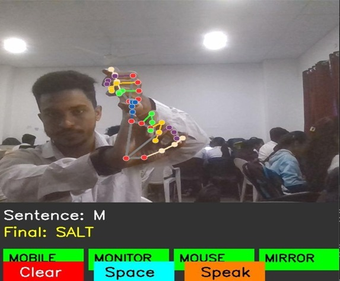

# Indian Sign Language (ISL) Text To Speech Translation in Real time 

Welcome to the **Indian Sign Language (ISL) Text To Speech Translation in Real time**! This project bridges the gap between spoken and sign languages, enabling seamless communication for individuals with hearing or speech impairments. The system supports two primary functionalities:

1. **ISL Detection and Translation**: Detects hand signs using **MediaPipe** and translates them into sentences in the user's native language.
2. **Speech to ISL Translation**:  Converts spoken language into ISL by displaying corresponding sign images from the dataset.
---


## Key Features:
### 1. **ISL Detection and Sentence Translation**
- **Hand Sign Detection**: Uses **MediaPipe** to detect both one-handed and two-handed signs.
- **Sentence Construction**: Converts detected characters into meaningful sentences.
- **Native Language Translation**: Translates the constructed sentence into the user's chosen native language.
- **Real-Time Feedback**: Displays the camera feed, detected letters, constructed sentences, and suggested words on a user-friendly GUI.


#### Process Workflow:
1. **Hand Tracking**: MediaPipe detects hand landmarks and extracts features.
2. **Character Prediction**: The model predicts the ISL character based on hand landmarks.
3. **Sentence Construction**:
   - Displays the detected character.
   - Constructs a sentence by appending detected characters.
   - Avoids repeated detections of the same character.
4. **Native Language Translation**:
   - Converts the English sentence to the user’s native language using a translation API.


---
### 2. **Speech to ISL Translation**
- **Speech Recognition**: Converts user’s speech input into text.
- **Text to ISL Conversion**: Maps words to ISL sign images using a pre-trained dataset.
- **Sequential Display**: Displays corresponding ISL images for each word in real-time.

#### Process Workflow:
1. **Speech Input**: User speaks into the microphone.
2. **Speech-to-Text Conversion**: Recognizes the spoken words using a speech recognition library.
3. **Sign Image Retrieval**:
   - Retrieves ISL sign images for each word.
   - Displays the images sequentially to represent the sentence visually.


---
## Technologies Used

### Backend
- **Python**
  - TensorFlow and Keras for deep learning models.images/speech_to_isl_translation.png
  - OpenCV for real-time video feed processing.
  - MediaPipe for hand landmark detection.

### Frontend
- **HTML, CSS, JavaScript**
  - User-friendly interface for camera feed and translation displays.

### Libraries and APIs
- **Speech Recognition**: For converting speech to text.
- **Translation API**: For translating English sentences into native languages.
- **MediaPipe**: For hand tracking and pose detection.
---

## Dataset
- **ISL Dataset**:
  - 35 Classes: A-Z and 1-9.
  - 1,200 grayscale images per class.
  - Adaptive thresholding applied to enhance feature extraction.

| **Class** | **Examples** | **Processed Images** |
|-----------|--------------|----------------------|
| A-Z       | Letters      | Adaptive Thresholding |
| 1-9       | Numbers      | Adaptive Thresholding |


---
## Installation
1. Clone this repository:
   ```bash
   git clone https://github.com/Swarajsolanke/Indian_Sign_to_text_translation.git
   ```
2. Install dependencies:
   ```bash
   pip install -r requirements.txt
   ```
3. Run the application:
   ```bash
   python app.py
   ```
---

## User Interface

### ISL Detection
- **Camera Feed**: Displays live video feed.
- **Adaptive Thresholding**: Shows processed hand landmarks.
- **Detected Character**: Displays the current detected ISL character.
- **Constructed Sentence**: Shows the sentence being formed.
- **Translation**: Converts the sentence to the user’s native language.


### Speech to ISL
- **Speech Input**: Allows the user to speak a sentence.
- **ISL Image Display**: Sequentially displays ISL images for the spoken sentence.


---
## Visual Representations
### Workflow Diagrams
#### ISL Detection Workflow:


#### Speech to ISL Translation Workflow:

# Website working:

# 1.Landinge page:
  this is the  Landinge page of our website wherein we provide the key feature of our website 


# 2.Home page:
  This is the home page of the website. Once the user visit the websites he will find the get started button once he click on this direct to next page of the website. Where he will get the two option Indian sign to text and speech to sign. 

  

# 3.Modules page:
  This is second page of the website where he will get the two option Indian sign language to text and vice versa option. Once he will click on one of the button will direct to next page of the modules.
   
   

# 4.Indian Sign text to speech:

   This is window of sign to text module where user is showing the sign image in real time that images is detected in real time in window .he will get the suggestion of word , provide three buttons for clear the text and providing the space in between the words . Once the sentence is created that can be hear by normal people. 
 
 

# 5.Speech To Indian Sign Language:

   In this module user will provide the speech in real time using mic button .user can provide speech into different regional-native languages in real time that can be provide to model it will provide corresponding sign image in output window. 

  


   
---
## Future Enhancements
- **Improved Accuracy**: Fine-tune the detection model for two-handed signs.
- **Dynamic Word Suggestions**: Implement real-time word prediction.
- **Offline Translation**: Enable translation without internet access.
---
## Contributions
We welcome contributions! Please follow these steps:
1. Fork the repository.
2. Create a feature branch.
3. Commit your changes.
4. Create a pull request.
---
## License
This project is licensed under the [MIT License](LICENSE).
---

## Contact
For any questions or feedback, please contact:
- **Email**:swarajsolanke02@gmail.com
- **GitHub**:(https://github.com/Swarajsolanke)
---

Thank you for using the Indian Sign Language Detection and Translation Project! Together, let’s make communication inclusive and barrier-free.


